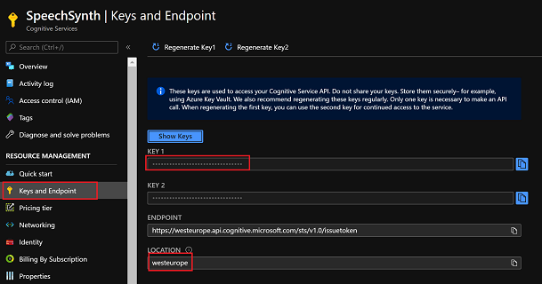
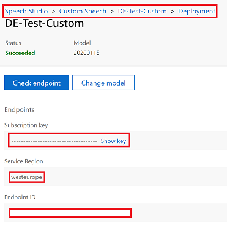
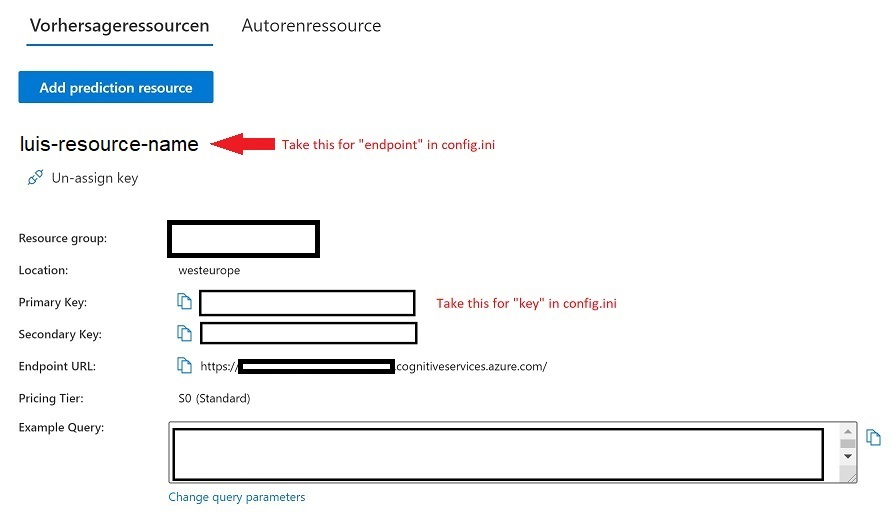

# Get your Keys
This documentation helps you to find the right keys for Azure Cognitive Services in order to use GLUE.

## Text to Speech (TTS)
- Go to the [Azure portal](https://portal.azure.com), open the Cognitive Service resource you want to use
- Be aware that not every voice is available in every Azure region

```
[tts]
key=
region=
resource_name=
language=
font=
```

## Speech to Text (STT)
- Go to the [Microsoft Speech Service portal](https://speech.microsoft.com), open your respective case and follow the breadcrumbs as illustrated below
- Copy the values from the highlighted fields
- In case you are not using a custom endpoint, it is sufficient to copy the subscription key as well as the region from your Azure Cogntitive Service resource in the [Azure portal](https://portal.azure.com)



The final file should look as below:
```
[stt]
key=
endpoint=
region=
```

## LUIS
 Open the file and set the respective keys for the `[luis]`-section. You can ignore the other parts. For this purpose, go to your LUIS app by accessing the [portal](https://luis.ai). Click on your app and click _MANAGE_. In the _Settings_-section, copy the _App ID_ and insert it in the file. Afterwards, go to _Azure Resources_ below, make sure you are in the tab _Prediction Resources and copy + paste the following keys and names:



For `slot`, either insert `staging` or `production`, depending which deployment slot you are using with your LUIS model. Region can remain blank.

The final section should look as below (fictonal keys):
```
[luis]
key=
app_id=
endpoint=
region=
slot=
treshold=0
```

## ffmpeg
In this section, we describe how to set up FFMPEG in case you do TTS.

### Windows
- Download the latest version of [ffmpeg](https://ffmpeg.org/download.html#build-windows).
- Extract the archive locally and copy the file `bin/ffpmeg.exe` to a location of your choice, e.g. to the `assets` folder of GLUE.
- Finally, copy the path and insert it in your config.ini as below.
```
[driver]
path=C:/glue/assets/ffmpeg.exe
```

### Ubuntu / Linux
- Open your command line.
- Make sure you have enough access rights to execute a `sudo` command or use the command line as root (not recommended).
- Install `ffmpeg` using the `apt-get` package manager.
```
apt-get install ffmpeg
```